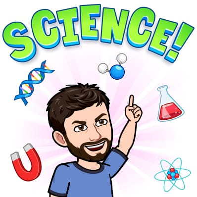
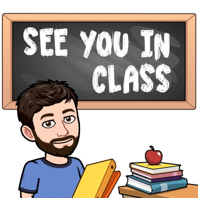

 My name is Rodolfo Lourenzutti. I am from a small coastal town in Brazil called Vila Velha (the metropolitan area has approx. 1.7 million inhabitants, but the city alone has approx. 500k inhabitants.) I have a beautiful wife and kid (16 months at the time of writing) and a dog named Git. Git loves fetching stuff (yeah, I named him Git just to make this joke!). He’s an adorable Red Golden Retriever. He’s now three years old.

As a kid, I wanted to do a ton of different things. I wanted to be a doctor, a fighter jet pilot, a psychologist, among other gazillion things. As I grew, I slowly settled into computer science. But then, at the time of application to the university, I suddenly changed my heart and decided to study Statistics (in Brazil, it is different - you pick your major before entering the university, not after). After that, I moved on to do an MSc in Statistics. I was fascinated by the broad range of applications of 

Statistics. No matter who I talked to, there was always a data collection and analysis part of their job, and very commonly, I heard the sentence, “You study statistics? Yuck! I had one course in college, very hard!” I found that fascinating. It is interesting to see how people love their field yet dislike the methods that analyze the data for them to make conclusions that they find very interesting. I have always found it liberating that I could work with people in many different areas. 
  
After my MSc, I started my Ph.D. in… care to guess? Statistics! But then, I decided to see things from a different perspective and switched to computer science. During my Ph.D., I visited the University of Alberta, Dept. of Electrical and Computer Engineering, and worked there for ten months. I returned to Brazil, finished my Ph.D., then moved back to U of A, but this time to the Dept. of Civil Engineering. I worked as a postdoc there for around 18 months. Then, I joined the Master of Data Science (MDS) at UBC as a Teaching Postdoctoral Fellow.

I worked at MDS under the mentorship of Michael Gelbart and Tiffany Timbers, who taught me A LOT about how to teach. After two years, I joined the Statistics Department at UBC in 2020, where I still am. I love teaching, I love data analysis, and I absolutely enjoy interacting with students. They are so interesting!

I created this website to share some of my thoughts and ideas about teaching and some tutorials about statistical methods and data analysis. I hope you find this material helpful. Please let me know if you have any questions or requests for tutorials. You can create an issue [here](https://github.com/Lourenzutti/lourenzutti.github.io/issues).

