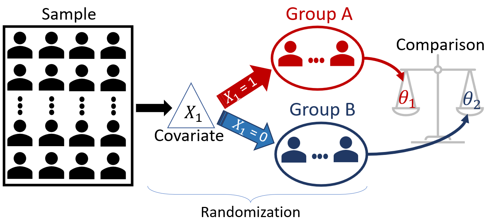
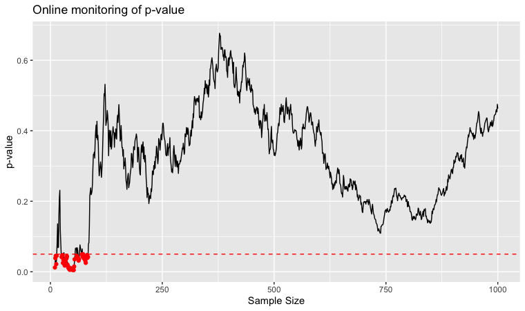
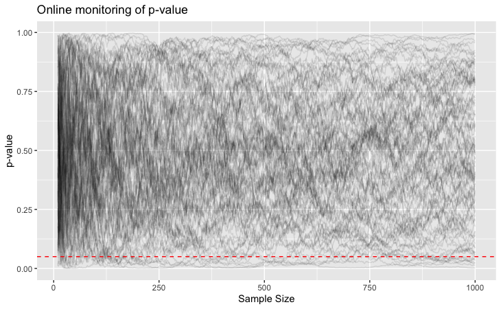

<script src="https://d3js.org/d3.v6.min.js"></script>
<!--Load local scripts-->
<script defer src="/scripts/controller.js"></script>
<script defer src="/scripts/random.js"></script>

Previously, we studied situations where the main interest is not the exact value of a population parameter
but, instead, which of the two mutually exclusive possible scenarios, namely $H_0$ or $H_1$, is true.
For example, we are not interested in the exact value of the population mean, $\mu$, but we are interested
in knowing if $\mu$ is higher than $35$mm or not.

In a classical hypothesis test, we generally use $H_0$ as the status quo hypothesis (i.e., the hypothesis
of nochange, no difference), where $H_1$ represents the anticipated change. Note that $H_1$ is the
alternative hypothesis, in the sense that if $H_0$ is false, then $H_1$ is true. It is not allowed for
both hypotheses to be false; one of the two hypotheses must be true. Also, the hypotheses are mutually
exclusive (i.e., both hypotheses cannot be true simultaneously).

<p style="text-indent: 0;">The general procedure for hypothesis testing is always the same:</p>

1. Define the hypotheses: $H_0$ and $H_1$; 

2. Specify the desired significance level.

3. Define a test statistic, $T$, appropriate to test the hypothesis.
   
4. Study the distribution of the test statistic as if $H_0$ were true. This distribution is called the <em>null distribution</em>.

5. Check the actual value of the test statistic using the data you collected.

6. Contrast the value of the test statistic with the null distribution by calculating the <em>p-value</em>.

7. If the p-value is smaller than the significance level, reject $H_0$, otherwise do not reject $H_0$.

## Motivational Problem

In 2008, Obama's campaign was looking to increase the total amount of donations to the campaign. To donate
online, people needed to subscribe to the campaign e-mail by clicking on a red button saying "Sign Up".

<figure>

<figcaption> Original website of the campaign.
<p class="source-img">Source: <a
        href="https://blog.optimizely.com/2010/11/29/how-obama-raised-60-million-by-running-a-simple-experiment/">Optimizely</a>
</p>
</figcaption>
</figure>

After a while, they started wondering: Is this website's design effective? They decided to test it! The
campaign created three alternative button designs (with text: *SIGN UP NOW*, *LEARN MORE*,
*JOIN US NOW*) and five different media choices to replace the original photo: two alternative photos
and three videos. In total, they compared 24 website designs.
they measured the subscription rate of each design. As it turns out, the best design had over 40% higher
subscription rate than the original website being used. It was estimated that the additional subscription
generated an additional 60 million dollars worth of donations and 288,000 additional volunteers. You can
learn more about this application of A/B testing [here](https://www.optimizely.com/insights/blog/how-obama-raised-60-million-by-running-a-simple-experiment/").


<p style="text-indent: 0;">But how do we compare websites?</p>

##### The response variable

The first step is to understand the purpose of the website. This is a fundamental
step because it guides the creation of useful metrics of success. Defining the main
purpose of a website is not always a simple task. For example, in their case:

<ul>
    <li>
        <p>Do they want the website to attract more subscribers?</p>
    </li>
    <li>
        <p>Do they want a high proportion of visitors to become donors?</p>
    </li>
    <li>
        <p>Do they want to increase the size of donation per visitor?</p>
    </li>
</ul>

What is a good metric to measure how effective the website is? Such metric will be
the **response variable** of the study. Although the campaign wanted
to increase the total amount of donations, this was not the website's purpose.
The purpose of the website was to attract subscribers. For this reason, they used
the rate of subscription, i.e., the number of people that subscribed divided by the
number of people that visited the website. If the website's purpose is not very well
defined, you might (and probably will) come up with metrics that are misleading on how
effective your website is. 

##### The covariates

The second step is to identify the elements that could be optimized. In their case,
they considered the media and the button. But they could consider other factors too,
such as the background colour, for example. In essence, they are trying to find the
configuration of the covariates, media and button, that would yield the highest
subscriber rate.

##### Randomization

To avoid bias, each visitor saw a randomly chosen website design. This is a key step
to be able to conclude that the reason for the increase in the subscription was the
website's design, and not a hidden factor that is not even being considered,
*lurking variable*. The idea is that randomization will "average out" all these
hidden differences between the visitors, and the only difference between the groups would
be the website seen.


## A/B Testing

A/B testing is not only about website optimization. In general, we have two populations (or groups),
namely Group A and Group B (hence A/B), and we want to compare these two populations with respect
to a variable of interest (response variable). Let's see a few examples:

<span class="example"></span>A new vaccine has been developed for cancer. The drug company wants to check the
efficacy of the vaccine. The company randomly split 50,000 volunteers into two groups, where 25,000 will
receive the vaccine (Group A) and 25,000 will receive the placebo (Group B). They measure if the individuals
develop cancer in the next ten years.

- <u><em>Response variable</em></u> ($Y$): whether the individuals develop cancer;

- <u><em>Covariate</em></u> ($X$): whether the individuals receives the vaccine or the placebo (two-levels);

- <u><em>Parameters of interest</em></u>: $p_1$ and $p_2$, the proportions of individuals who develop cancer in Group A and Group B, respectively;

- <u><em>Research question</em></u>: is the vaccine effective? In other words, is $p_1 < p_2$?

<div class="end-part"></div>

<span class="example"></span>
A phone company wants to reduce the number of complaints against its customer services. They are considering
removing the navigation menu from the support service and using support staff instead. Naturally, this will be an
expensive move, so they first want to test it to see if it would be effective. They trained a small team and randomly
directed the clients to the navigation menu or human support. Then, they monitor whether the clients will open a complaint at the
Canadian Radio-television and Telecommunications Commission (CRTC).

- <u><em>Response variable</em></u> ($Y$): whether the individual opens a complaint;

- <u><em>Covariate</em></u> ($X$): whether the individual is directed to the navigation menu or the support staff (two-levels);

- <u><em>Parameters of interest</em></u>: $p_1$ and $p_2$, the proportion of clients that open a complaint at CRTC in Group A and Group B, respectively;

- <u><em>Research question</em></u>: is the support staff better? In other words, is $p_1 < p_2$?

<div class="end-part"></div>

<span class="example"></span> An e-commerce company wants to compare two website designs with respect to sales in dollars. For the following $N$ clients, the design each client will see will be selected at random.

- <u><em>Response variable</u></em> ($Y$): the amount of dollars spent;

- <u><em>Covariate ($X$)</u></em>: two website designs (two-levels);

- <u><em>Parameters of interest</u></em>: $\mu_1$ and $\mu_2$, the average amount of dollars spent by the clients in each website design;

- <u><em>Research question</u></em>: Is one of the designs better?

<div class="end-part"></div>

<p style="text-indent: 0;">In general, the structure of A/B Testing consists of: 

1. a response variable, $Y$;

2. a covariate, $X$, that splits the population into two groups; 

3. randomization, individuals are randomly assigned to the groups; and 

4. statistical comparison of the groups' parameter of interest (remember that all we have is a sample, so we need to account for the sampling variability.

<figure>
    
    <figcaption> A/B Testing Workflow</figcaption>
</figure>

#### How is Obama's Campaign Problem Different?

Note that in case of the Obama's campaign website, we have:

1. Response variable: the subscription rate; &#x2705;

2. Randomization; &#x2705;

3. One covariate that splits the population into two groups; <span style="color: red;">&#x2718;</span>


We had <strong>two</strong> covariates, $X_1$ and $X_2$, which are the button design and the media used,
respectively. Besides, $X_1$ had four levels (i.e., possible values): the four design options or the
button. This would split the population into four groups, not into two. $X_2$, the media variable, had six
levels, three photos and three videos. Combining $X_1$ and $X_2$ results in a total of 24 groups.

This problem is slightly more complex than having only two groups. If we performed pairwise comparisons, we
would need 276 tests to compare all 24 groups. As we learned previously, this would considerably inflate the
probability of error. For now, let us restrict our focus to only two groups. We will discuss more groups later. 

### Comparing the two groups

Once the appropriate response variable and covariate have been specified, we start collecting the data. The
data collected will be only a sample of the population; therefore, we need to take into account the sampling
variability. We are already familiar with the methodology to conduct this statistical analysis, namely
two-samples confidence intervals and hypothesis tests. Let's refresh our memory!

When estimating or testing hypotheses, the parameter of interest affects which statistic we are going to
use. For example, when testing the mean, we want to use the sample mean $\bar{X}$, when testing difference
in proportion, we want to use the difference in sample proportions, $\hat{p}_1 - \hat{p}_2$, and so on.

Naturally, the way these statistics behave are different, i.e., the sampling distributions (and null models)
of these statistics are different. We have explored two main approaches to approximate the
sampling distribution (for confidence intervals) and the null model (for hypothesis testing): (1) the
Central Limit Theorem (CLT); and (2) Simulation Based Approaches.

#### Central Limit Theorem
When estimating or testing hypotheses, the parameter of interest affects which statistic we are going to
use. For example, when testing the mean, we want to use $\bar{X}$, whereas when testing the median, we 
want to use the sample median, and so on. The Central Limit Theorem provides an approximation for 
the distribution of certain test statistics for large sample size.

##### Comparing two means 

Suppose you want to test the difference between two <em>independent</em> populations' means. The scenarios to
be considered:

- $H_0: \mu_A - \mu_B = d_0$ vs $H_1: \mu_A - \mu_B \neq d_0$

- $H_0: \mu_A - \mu_B = d_0$ vs $H_1: \mu_A - \mu_B > d_0$

- $H_0: \mu_A - \mu_B = d_0$ vs $H_1: \mu_A - \mu_B < d_0$

To conduct this hypothesis test, we take two independent samples, one from each population. By independent
samples, we meant that the individuals are selected independently from each population.

Suppose Group A has $n_A$ elements drawn at random from Population A, and Group B has $n_B$ elements
drawn at random from Population B. Let's use $x$ to refer to Group A and $y$ to refer to Group B. For
large samples sizes, the test statistic given by
$$
T = \frac{\bar{x}-\bar{y} - d_0}{\sqrt{\frac{s_A^2}{n_A} - \frac{s_B^2}{n_B}} }
$$
follows a $t$-distribution with approximately $\nu$ degrees of freedom under $H_0$, where
$$
\nu = \frac{
\left(\frac{s_A^2}{n_A}+\frac{s_B^2}{n_B}\right)^2
}
{
\frac{s_A^4}{n_A^2(n_A-1)}+\frac{s_2^4}{n_B^2(n_B-1)}
}.
$$

<p style="text-indent: 0;">In other words, the <em>null model</em> of the test statistic above is $t_\nu$. Of
    course, we are never going to calculate this weird formula by hand! Our computers
    can do this for us.</p>

<span class="example"></span>
    Suppose Obama's campaign wanted to test which of two websites, <em>Website A</em> or
    <em>Website B</em>, results in a larger amount of donations. The next 60 users who visit the campaign's
    website will access one of the websites chosen at random until 30 users have seen one of the designs. We
    have collected (actually simulated!) this data for you and stored it in the
    <code>sample_money_donated</code> object.

```{r, echo = TRUE}
suppressMessages(library(tidyverse))
set.seed(1)

# Simulating a sample of 30 individuals for group A and Group B
sample_money_donated <- 
tibble(group = c("Website A", "Website B"), 
    amount = list(
        if_else(runif(30) < 0.5, 0, rnorm(30, 80, 10) ), 
        if_else(runif(30) < 0.6, 0, rnorm(30, 100, 20) ))
    ) %>% 
unnest(cols = amount) %>%
sample_n(60)

sample_money_donated
```

Next, to test $H_0: \mu_A - \mu_B = d_0$ vs $H_1: \mu_A - \mu_B \neq d_0$, we can use the
<code><a href="https://www.rdocumentation.org/packages/stats/versions/3.6.2/topics/t.test" target="_blank">t.test</a></code>
function in R.

```{r, echo = TRUE}
t.test(amount ~ group,  # The formula: "website affects amount".
       mu = 0, # the value of d0
       alternative = "two.sided", # "less" for < and "greater" for >;
       data = sample_money_donated)
```

##### Comparing two proportions

Obama's campaign wanted the website to increase the number of subscribers and, for this reason, they used the
rate of subscription. In this case, the variable of interest, <em>"whether a visitor subscribes"</em>, is
not numerical, is dichotomic: "yes" or "no". Consequently, we would want to compare the proportions of
visitors who subscribes using <em>Website A</em> and <em>Website B</em>.

To test for the equality of proportions between two groups, i.e., $H_0: p_A - p_B = 0$ vs $H_1: p_A - p_B
\neq 0$, we can use the following test statistics:
$$
Z = \frac{\hat{p}_A-\hat{p}_B}{\sqrt{\hat{p}(1-\hat{p})\left(\frac{1}{n_A}+\frac{1}{n_B}\right)}},
$$

<p style="text-indent: 0;">where $\hat{p}=\frac{n_A\hat{p}_A+n_B\hat{p}_B}{n_A+n_B}$ is the overall
proportion. For large sample sizes, the null model of the $Z$ statistic is the Standard Normal distribution, $N(0,1)$. Again, we will not do this manually, as we can easily calculate using the computer. </p>

<span class="example"></span>
Suppose Obama's campaign wanted to test which of two websites, <em>Website A</em> or
<em>Website B</em>, results in a higher rate of subscribers. The next 60 users who visit the campaign's
website will access one of the websites chosen at random until 30 users have seen one of the designs. We
have collected this data for you and stored it in the
<code>sample_subscriber</code> object.

```{r, echo = TRUE}
library(tidyverse)
library(infer)

set.seed(1)

# Simulating a sample of 30 individuals for group A and Group B
sample_subscriber <- 
tibble(website = factor(c("A", "B")), 
    subscribed = list(
        sample(factor(c("yes", "no")), 30, replace = TRUE, p=c(0.42, 0.58)), 
        sample(factor(c("yes", "no")), 30, replace = TRUE, p=c(0.37, 0.58)))
    ) %>% 
unnest(cols = subscribed) %>%
sample_n(60)

sample_subscriber
```

Once the data is collected, we can run <code><a href="https://www.rdocumentation.org/packages/stats/versions/3.6.2/topics/prop.test" target="_blank">prop.test</a></code> in R to test the hypothesis.

```{r, echo = TRUE} 
prop.test(
    sample_subscriber %>% 
    group_by(website) %>% 
    summarise(n_successes = sum(subscribed == "yes"), 
            n_failures = sum(subscribed == "no")) %>% 
    select(-website) %>% 
    as.matrix())
```

#### Simulation Based Approach

Alternatively to the CLT, we could use computer simulations to compare the groups. The same idea we discussed
previously:

1. Collect the samples of Group A and Group B;

2. Calculate the observed test statistic;

3. Put the sample of both groups together;

4. Select $n_1$ elements at random, <strong>without</strong> replacement, from the two samples combined.

5. The selected elements will be your "new" Group A, and the remaining will be your "new" Group B. 

6. Calculate the appropriate test statistic (e.g., the difference of sample proportions or of sample means).

7. Perform Steps 4, 5 and 6, multiple times to obtain a sample from the <em>Null Distribution </em>.
    
8. Compare the observed test statistic with the simulated null model.


Note that by randomizing the groups in the sample (Steps 3, 4, and 5), we are trying to remove the difference between the groups, except for those differences due to sampling variability. But why are we doing that again? Because we want to simulate a sample from the Null Model, which is the model under the assumption that there is no difference between the groups. 

<span class="example"></span>
Let's return to Obama's campaign problem in the example above. We want to test which website, Website A or
Website B, has a higher subscription rate. The data is stored in <code>sample_subscriber</code>.

```{r, echo = TRUE}
sample_subscriber
```

First, we calculate the observed test statistic. Since we are comparing the proportions, we can use the
difference of sample proportions as our test statistic.

```{r, echo = TRUE}
obs_test_statistic <- 
    sample_subscriber %>% 
    specify(formula = subscribed ~ website, success = "yes") %>% 
    calculate(stat = "diff in props", order = c("A", "B"))

obs_test_statistic
``` 

Next, we simulate a sample from the null model by following Steps 3-6. Luckily for us, we don't need to do this manually as we are already familiar with <code>infer</code>'s workflow.

```{r, echo = TRUE}
sample_null_model <- 
    sample_subscriber %>% 
    specify(formula = subscribed ~ website, success = "yes") %>% 
    hypothesise(null = "independence") %>% 
    generate(reps = 5000, type = "permute") %>% 
    calculate(stat = "diff in props", order = c("A", "B"))

sample_null_model
```

Finally, we compare the observed test statistic with the null model. Since the observed test statistic is $0.0333$, we calculate the proportion of values generated from the null model that are above $0.0333$ or below $-0.0333$. This will be the estimated p-value of the test. 

```{r, echo = TRUE}
sample_null_model %>% 
    get_p_value(obs_test_statistic, direction = "both")
```
<div class="end-part"></div>

There's nothing new in these analyses, right? We have already discussed statistical inference involving two-sample. So, why are we discussing this again? As it turns out, A/B Testing is just another name that was coined in the industry for Randomized Experiments, a well-established statistical methodology for experimentation. Hence the familiarity of the methods above. That would be the end of it, except that some challenges arise in practice that requires close attention.

### Early Stopping

In many situations, there is crushing evidence that a group is performing better than the other. So, should a company keep spending resources and time to continue the experiment as planned? Continuing with the experiment could be unnecessarily costly.

<p style="margin-bottom: 0;"><span class="example"></span> 
Suppose Pfizer, a pharmaceutical company, is conducting a clinical trial to test the effectiveness of a new treatment. They planned to have 1,000 participants in total, 500 of which will receive the new drug, and the remaining 500 will receive the placebo. However, at the current point in time, they have data of 600 participants, where 300 received the drug and 300 received the placebo. Among the 300 who received the drug, nobody died. On the other hand, among the 300 who received the placebo, 200 died. Should the FDA (Food and Drug Administration) still wait for the result of the remaining 400 participants? Or should they stop the clinical trial early and start distributing the medicine to people in need?

<div class="end-part"></div>

<!--Make the following two paragraphs an exercise-->
In general, we not only want to compare Groups A and B, but we also want to reach a conclusion as soon as possible. To do so, one would have to "peek" at the partially collected data to conduct the proper statistical analysis. However, when should we peek at the partially collected data?

A reasonable answer could be to monitor the data online. In other words, for every new observation in each group we have, we take a peek at the data.

<span class="example"></span>Suppose Obama's campaign wanted to test two website designs, and they are interested in the amount of money donated per visitor. So, they decided to conduct an A/B Test and start monitoring as soon as they had ten visitors for each design. Then, they would peek at the data again once both designs had received another visitor, and so on. If they detect a difference, they will immediately stop the experiment and make the best website version available to all visitors. They will allow a maximum number of visitors of 1,000 per design.

<figure>

<figcaption> A/B Test with two versions of Obama's campaign website.
    <p class="source-img">Source: Obama's pictures<a
            href="https://blog.optimizely.com/2010/11/29/how-obama-raised-60-million-by-running-a-simple-experiment/">Optimizely</a></p>
</figcaption>
</figure>
<figure>

<figcaption> Multiple checks of p-value for different sample sizes </figcaption>
</figure>


<div class="end-part"></div>
In the example above, Obama's campaign wants to use a strategy that does not specify the sample size. So far, we have been discussing inference scenarios where the sample size is determined <strong>prior to the study</strong>. But in this case, the methodology will not change because the sample size will be fixed at each <em>peek</em>. The problem is that we are experimenting multiple times with different sample sizes.


<div class="box-def box-exercise">
<p></p>
<p>When conducting hypothesis testing, what are the effects that sample size has on:</p>
<ol>
    <li class="question-item">
        <p>Probability of Type I Error</p>
        <textarea class="answer" style="height:50px;"></textarea><br>
    </li>
    <li class="question-item">
        <p>Probability of Type II Error</p>
        <textarea class="answer" style="height:50px;"></textarea><br>
    </li>
    <li class="question-item">
        <p>Power of the test</p>
        <textarea class="answer" style="height:50px;"></textarea>
    </li>
</ol>
<button class="btn-show-answers">Show answers</button>
<div class="solution">
<dl>
<dt>Probability of Type I Error</dt>
<dd>None. Remember that the probability of Type I Error is the significance level, which is
    specified by us before the test is conducted.</dd>

<dt>Probability of Type II Error</dt>
<dd>The Probability of Type II Error decreases as the sample size increases. The reason is that
    both the null model and the sampling distribution of the test statistic will become narrower,
    hence reducing their overlap.
</dd>

<dt>Power of the test</dt>
<dd> The power of the test is just one minus the probability of Type II Error. Since the probability
    of Type II Error decreases as the sample size increases, the power of the test increases as the
    sample size increases.
</dd>
</dl>
</div>
</div>

Ok, so Obama's campaign seems to have a good plan. The probability of Type I Error at each peek will be the same; the power of the test will be smaller, but if it is already big enough to detect a difference, kudos! No downside here, right? Wrong!While the probability of Type I Error is the same at each peek, they only need to reject the hypothesis once in multiple tests.

<div class="box-def box-exercise">
<p></p>
<p style="text-indent: 0;">
When conducting multiple hypothesis testing, what happens to the family-wise errors?
</p>
<textarea class="answer" style="height:50px; width: 90%;"></textarea><br>
<button class="btn-show-answers">Show answers</button>
<div class="solution">
Since you need to make the right decision multiple times, and each time there is a chance that you make
the wrong decision,
when you consider whether <strong>all</strong> the decisions you made are right, there is a much lower
chance of that happening compared to each hypothesis testing individually.
</div>
</div>

<span class="example"></span> Let's continue our previous example of Obama's campaign. The first thing we
should do is to test if the plan is good. But how can we do that if we do not know the truth (i.e., if
there's actually a difference between the two websites): Here's our we are going to do it:

<ol>
<li>
Let's run the experiment 100 times.
<figure>

<figcaption> One hundred A/B Tests with two versions of Obama's campaign website.
<p class="source-img">Source: Obama's pictures <a
    href="https://blog.optimizely.com/2010/11/29/how-obama-raised-60-million-by-running-a-simple-experiment/">Optimizely</a>
</p>
</figcaption>
</figure>
</li>
<li>
But this time, we are going to use the same website for both groups. This way, we know the truth -- there's no difference!!
<figure>

<figcaption> One hundred A/B Test with the same version of Obama's campaign website.
<p class="source-img">Source: Obama's pictures <a
    href="https://blog.optimizely.com/2010/11/29/how-obama-raised-60-million-by-running-a-simple-experiment/">Optimizely</a>
</p>
</figcaption>
</figure>
<figure>

<figcaption> Multiple checks of p-value for different sample sizes in each of the 100 experiments. </figcaption>
</figure>
</li>
<li>
Let's see in how many of the 100 experiments the null hypothesis is rejected at least once. That will
estimate how bad the chance of our <em>family-wise</em> Type I Error will be.
</li>
</ol>

In this case, using a significance level of $5\%$, approximately $22\%$ of the $100$ A/B tests would have wrongly rejected $H_0$ and concluded that the same version of the website is different from itself. This is way above our specified significance level of $5\%$. Terrible, isn't it? Obama's campaign is in a bit of a pickle now. It seems they have to wait for 2000 people to visit the website before they can examine whether there's a difference. Do they, though?

We have learned about p-value adjustments to control for Type I Error. Remember Bonferroni's correction? So we could propose a compromise to them:

*- "Hey, don't peek at the data for every two people that visit your website.
Instead, pick a reasonable number of tests, and I'll adjust the p-value so we can control the
probability of Type I Error."*

<p style="text-indent: 0;">They can decide when to conduct the test, say for example, $n = 50$, $n = 100$, $n = 250$, $n = 500$, and $n = 1000$. Doing this in the Obama's problem would reduce the number of rejection to 7 experiment, much closer to the $5\%$ specified. This approach is called <em>principled peeking</em>.</p>


<div style="height: 400px;">

</div>
