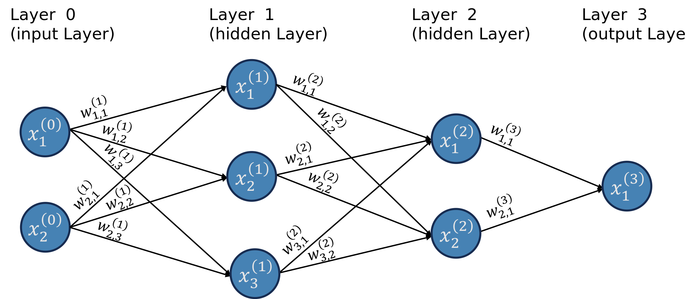
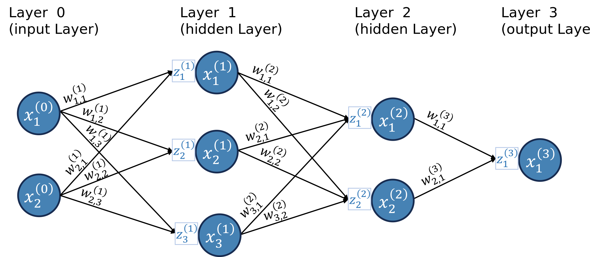
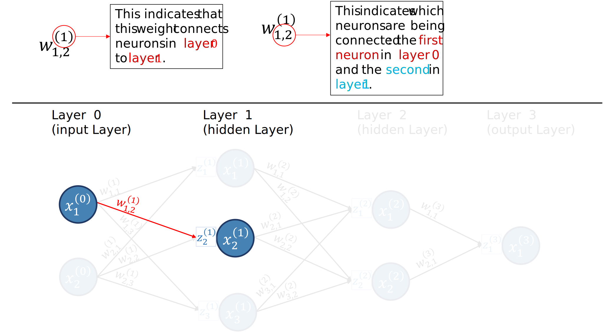
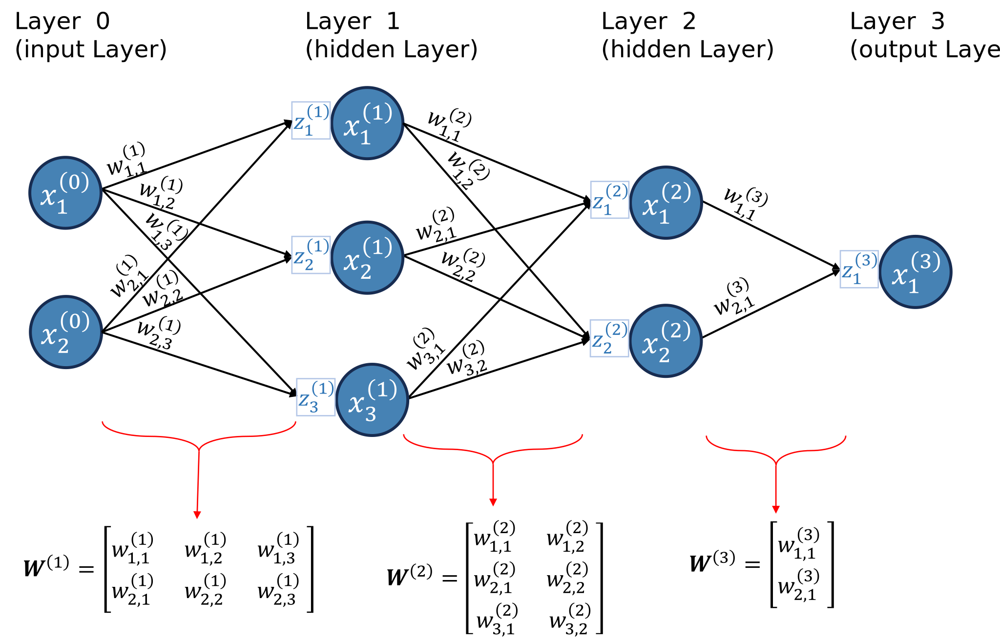
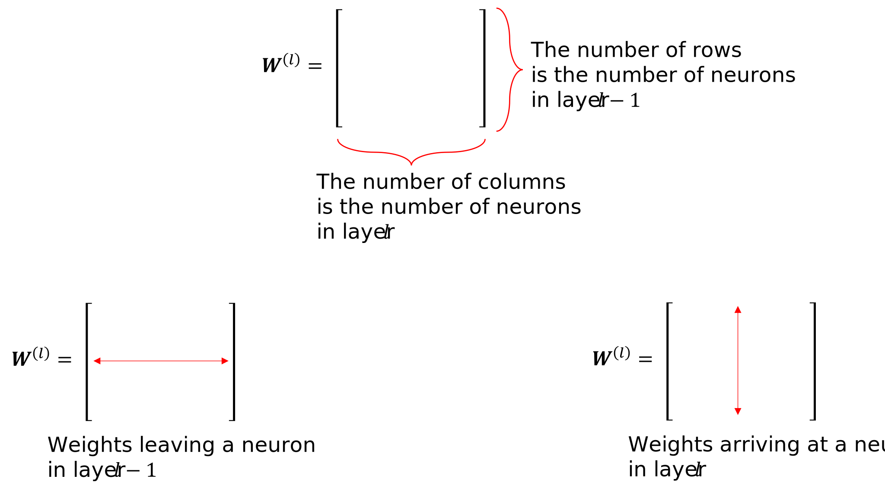
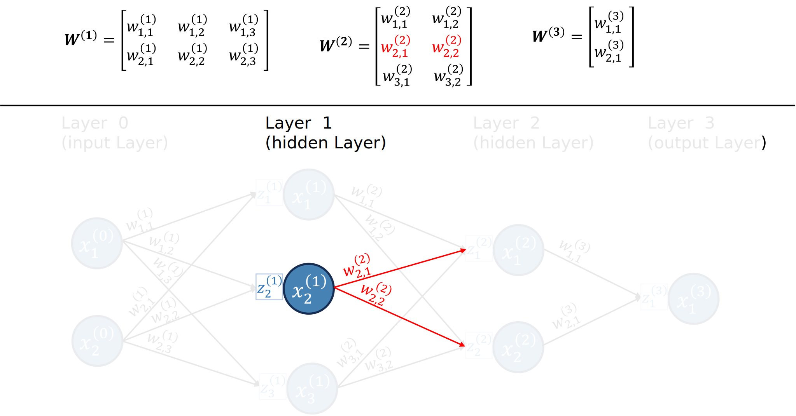
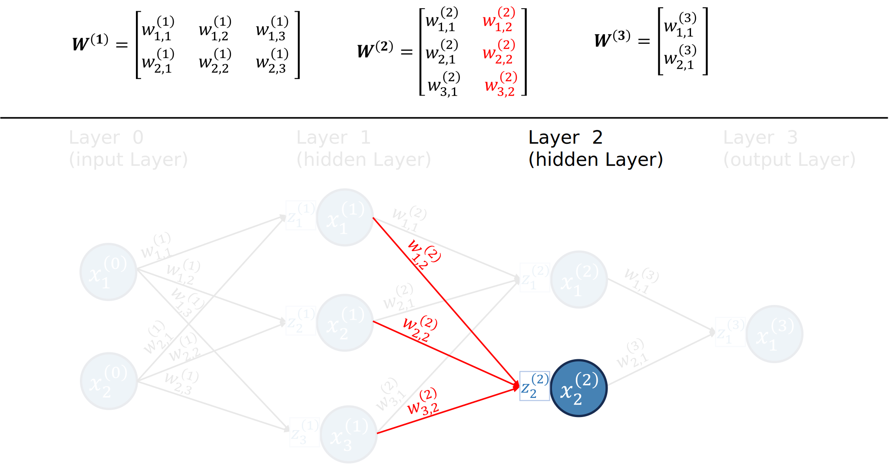

<style>
    main {
        text-align: justify;    
    }
</style>
<script src="https://cdn.plot.ly/plotly-latest.min.js"></script>
<script src="https://d3js.org/d3.v6.min.js"></script>
<script src="https://polyfill.io/v3/polyfill.min.js?features=es6"></script>
<script id="MathJax-script" async src="https://cdn.jsdelivr.net/npm/mathjax@3/es5/tex-mml-chtml.js"></script>
<!--<script defer src="scripts/plot_nn.js"></script>-->


```{js}
//| echo: false
function createNeuralNetwork(layers, div_name, drawZSquares=true, neuronRadius = 20, squareSize = 20, width = 1000, height = 400) {

    const layerWidth = width / layers.length;
    //const fontSize = neuronRadius / 2; // Set font size proportional to neuron radius
    const fontSize = 14;
    squareSize = drawZSquares ? squareSize : -2;
    
    // Clear previous content
    //d3.select(`#${div_name}`).html('');

    // Create SVG element for lines and neurons
    const svg = d3.select(`#${div_name}`).append("svg")
        .attr("width", width)
        .attr("height", height)
        .style("position", "absolute");

    // Function to calculate Y positions
    const calculateY = (layerIndex, nodeIndex, totalNodes) => {
        const spacing = height / (totalNodes + 1);
        return (nodeIndex + 1) * spacing;
    };

    // Draw connections (lines) and weight annotations
    for (let l = 0; l < layers.length - 1; l++) {
        for (let i = 0; i < layers[l]; i++) {
            for (let j = 0; j < layers[l + 1]; j++) {
                const x1 = (l + 0.5) * layerWidth;
                const y1 = calculateY(l, i, layers[l]);
                const x2 = (l + 1.5) * layerWidth - neuronRadius - squareSize - 2;
                const y2 = calculateY(l + 1, j, layers[l + 1]);

                // Draw line
                svg.append("line")
                    .attr("x1", x1)
                    .attr("y1", y1)
                    .attr("x2", x2)
                    .attr("y2", y2)
                    .attr("stroke", "black")
                    .attr("stroke-width", 1);

                // Calculate position and rotation for weight annotation
                const scaler = 0.8;
                const annotationX = x1 + neuronRadius + (drawZSquares ? 10 : 20);
                const slope = (y2 - y1) / (x2 - x1);
                const angle = Math.atan(slope) * (180 / Math.PI);
                const annotationY = y1 + slope * (annotationX - x1) - scaler*fontSize - 2;

                const weightAnnotation = `w_{${j + 1}${i + 1}}^{(${l + 1})}`;
                d3.select(`#${div_name}`).append("div")
                    .attr("class", "weight-annotation")
                    .style("left", `${annotationX}px`)
                    .style("top", `${annotationY}px`)
                    .style("font-size", `${scaler*fontSize}px`)
                    .style("transform", `translateY(-50%) rotate(${angle}deg)`)
                    .html(`\\(${weightAnnotation}\\)`);
            }
        }
    }

    // Draw neurons and neuron annotations
    layers.forEach((numNeurons, layerIndex) => {
        const x = (layerIndex + 0.5) * layerWidth;
        const layerAnnotation = `Layer ${layerIndex}`;
        svg.append("text")
            .attr("x", x)
            .attr("y", 20) // Position at the top, you can adjust this value
            .attr("text-anchor", "middle")
            .attr("font-family", "Arial")
            .attr("font-size", "16px")
            .text(layerAnnotation);
        for (let i = 0; i < numNeurons; i++) {
            const y = calculateY(layerIndex, i, numNeurons);

            // Draw neuron
            svg.append("circle")
                .attr("cx", x)
                .attr("cy", y)
                .attr("r", neuronRadius)
                .attr("fill", "steelblue");

            // Add neuron annotation
            const neuronAnnotation = `x_{${i + 1}}^{(${layerIndex})}`;
            d3.select(`#${div_name}`).append("div")
                .attr("class", "neuron-annotation")
                .style("left", `${x}px`)
                .style("top", `${y}px`)
                .style("font-size", `${fontSize}px`)
                .style('color', 'white')
                .html(`\\(${neuronAnnotation}\\)`);

            // Draw annotation for non-input neurons
            if (layerIndex > 0 && drawZSquares) {
                const rectX = x - neuronRadius - squareSize - 1;
                const rectY = y - squareSize / 2;

                const squareAnnotation = `z_{${i + 1}}^{(${layerIndex})}`;
                d3.select(`#${div_name}`).append("div")
                    .attr("class", "annotation")
                    .style("left", `${rectX}px`)
                    .style("top", `${rectY}px`)
                    .style("width", `${squareSize}px`)
                    .style("height", `${squareSize}px`)
                    .style("line-height", `${squareSize}px`)
                    .style("font-size", `${0.8*fontSize}px`)
                    .html(`\\(${squareAnnotation}\\)`)
                    .on("click", () => propagateFromZSquare(layerIndex, i));;
            }
        }
    });
    
    // Function to animate impulse
    function animateImpulse(startX, startY, endX, endY, duration) {
        const impulse = svg.append("circle")
            .attr("cx", startX)
            .attr("cy", startY)
            .attr("r", 5)
            .attr("fill", "red");

        impulse.transition()
            .duration(duration)
            .attr("cx", endX)
            .attr("cy", endY)
            .on("end", () => impulse.remove());
    }

    // Function to propagate impulse
    function propagateImpulse(layerIndex, neuronIndex) {
        if (layerIndex < layers.length - 1) {
            for (let j = 0; j < layers[layerIndex + 1]; j++) {
                const startX = (layerIndex + 0.5) * layerWidth;
                const startY = calculateY(layerIndex, neuronIndex, layers[layerIndex]);
                const endX = (layerIndex + 1.5) * layerWidth - neuronRadius - squareSize - 2;
                const endY = calculateY(layerIndex + 1, j, layers[layerIndex + 1]);

                animateImpulse(startX, startY, endX, endY, 1200);

                // Recursive call for next layer
                setTimeout(() => propagateImpulse(layerIndex + 1, j), 1000);
            }
        }
    }

    // Function to propagate impulse from a Z square
    function propagateFromZSquare(layerIndex, neuronIndex) {
        if (layerIndex < layers.length - 1) {
            for (let j = 0; j < layers[layerIndex + 1]; j++) {
                const startX = (layerIndex + 0.5) * layerWidth;
                const startY = calculateY(layerIndex, neuronIndex, layers[layerIndex]) + squareSize / 2;
                const endX = (layerIndex + 1.5) * layerWidth - neuronRadius - squareSize - 2;
                const endY = calculateY(layerIndex + 1, j, layers[layerIndex + 1]);

                animateImpulse(startX, startY, endX, endY, 1200);
            }
        }
    }

    // Draw neurons and neuron annotations
    layers.forEach((numNeurons, layerIndex) => {
        for (let i = 0; i < numNeurons; i++) {
            const x = (layerIndex + 0.5) * layerWidth;
            const y = calculateY(layerIndex, i, numNeurons);

            // Draw neuron
            svg.append("circle")
                .attr("cx", x)
                .attr("cy", y)
                .attr("r", neuronRadius)
                .attr("fill", "steelblue")
                .attr("cursor", "pointer")
                .on("click", () => propagateImpulse(layerIndex, i));

        }
    });
    // Render MathJax
    MathJax.typesetPromise();
}
```

**Learning Objectives:** <br>

At the end of this tutorial, the reader should be able to:

- Calculate the forward pass of a neural network;
- Calculate the backpropagation of a neural network;
- Implement a neural network from scratch in Python;
- Implement a neural network using PyTorch;

**Prerequisites:** <br>

It is assumed that the reader :

- possesses a level of proficiency in computing derivatives, particularly in the application of the Chain Rule.
- has some Python knowledge;
- is able to perform matrix multiplication;
 

<hr>

In this tutorial, we will explore how feedforward neural networks work. We'll discuss neurons, layers, activation functions, and cost functions. Then, we'll see in detail how we train a neural network using backpropagation. We will derive the backpropagation formulae step-by-step and implement a neural network from scratch using Python's Numpy package only. 

We will need a neuron network diagram to help illustrate the steps of creating and training a neural network. If this is not the first post you've read about neural networks, you may have seen the diagram below.

:::{#fig-nn-regular}



The usual Neural Network diagram (bias neurons omitted).
:::

When I started learning about neural networks, I found the standard diagram confusing because it doesn't explicitly show a crucial component needed for the backpropagation algorithm. Therefore, for this tutorial, we will explicitly include this component to the diagram, as shown in @fig-nn-diagram. 

:::{#fig-nn-diagram}



A Neural Network diagram including the linear aggregator $z^{(l)}_{i}$  (again, bias neurons omitted).
:::

Let's introduce some terminology:

- **Layers**: This neuron network has four layers. 
    - **Input layer:** the first layer is known as the input layer; it brings the data into the network.
    - **Output layer:** the last layer is known as the output layer; it provides the numerical outputs of the neural network.
    - **Hidden layers:** the layers between the input and output layers are known as the hidden layers; in this case, layers 1 and 2 are hidden layers. 

- **Neurons:** the blue circles are the so-called neurons; neurons send a numerical value as a signal for the neurons in the following layer. 
  - Different layers can have different numbers of neurons.
  - The signals neurons in the input layer send are the data. 
  - The number of neurons in the input layer is the number of attributes in the dataset.
  - **Activation function:** a non-linear function that specifies how neurons process the signals they receive. This function is not explicitly showed in the graph, but it is "inside" the neuron. 

- **Weights:** the weights are numerical values (positive or negative) that amplify or reduce the strength of a neuron's signal to another neuron; they are represented in the graph by the lines;

- **Receptors:** we will call the boxes attached to each neuron the neuron's receptor, which will collect and aggregate all the signals a neuron receives from other neurons (this is not standard language); 

I've always found the terminology very confusing without looking at the equations. For example, when I say that weights amplify or reduce the signal, how exactly does that happen? How exactly do receptors collect and aggregate all the signals? How do neurons process the signals passed by the receptors? Before we go over these in detail, let's review the notation we are using.

:::{#fig-nn-notation}



The weight $w_{1,2}^{(1)}$ connects the neurons $X^{(0)}_1$ and $X^{(1)}_2$.
:::

- $(l)$ refers to the layer, and goes from 0 to $L$, where the $L$th layer is the output layer. 
- $n^{(l)}$ is the number of neurons in layer $l$.
- $X^{(l)}_i$ is the $i$th neuron in layer $l$.
- $Z^{(l)}_i$ is the receptor of neuron $X^{(l)}_i$.
- $w_{i,j}^{(l)}$ is the weight connecting the $i$th neuron in layer $l-1$ to the $j$th neuron in layer $l$.

Since we have a ton of weights, it is helpful for us to organize them into matrices. We will have one weight matrix per layer (except for layer 0). We will denote the matrices as ${\bf{W}}^{(l)}$. @fig-nn-matrix-weights illustrates how the weights are organized into matrices for our example neural network.

:::{#fig-nn-matrix-weights}



The weight $w_{1,2}^{(1)}$ connects the neurons $X^{(0)}_1$ and $X^{(1)}_2$.
:::

The matrix ${\bf{W}}^{(l)}$ contains the weights connecting neurons in layer $l-1$ to neurons in layer $l$. It has $n^{(l-1)}$ rows and $n^{(l)}$ columns. The $i$th row of ${\bf{W}}^{(l)}$ are all weights "leaving" neuron $i$ from layer $l-1$. The $j$th column of ${\bf{W}}^{(l)}$ are all the weights arriving to neuron $j$ in layer $l-1$. @fig-weight-matrix-shape illustrates these points. 

:::{#fig-weight-matrix-shape}



Shape of matrix ${\bf{W}}^{(1)}$.
:::

For example, the second row of ${\bf{W}}^{(2)}$ has all the weights leaving neuron 2 from layer 1, as shown in @fig-weight-matrix-row; while the second column has all the weights arriving at neuron 2 in layer 2, as illustrated in @fig-weight-matrix-column.

:::{#fig-weight-matrix-row}



The second row of ${\bf{W}}^{(2)}$ has all weights "leaving" neuron 2 in layer 1.
:::


:::{#fig-weight-matrix-column}



The second column of ${\bf{W}}^{(2)}$ has all weights "arriving" at neuron 2 in layer 2.
:::

So, at this point, I want us to zoom in on some parts of the neural network to see what is happening. 

